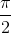
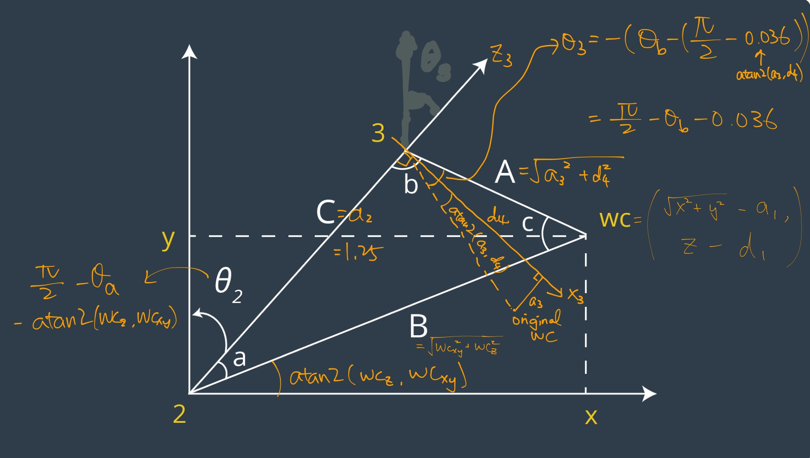

## Project: Kinematics Pick & Place
### Writeup Template: You can use this file as a template for your writeup if you want to submit it as a markdown file, but feel free to use some other method and submit a pdf if you prefer.

---

**Steps to complete the project:**  

1. Set up your ROS Workspace.
2. Download or clone the [project repository](https://github.com/udacity/RoboND-Kinematics-Project) into the ***src*** directory of your ROS Workspace.  
3. Experiment with the forward_kinematics environment and get familiar with the robot.
4. Launch in [demo mode](https://classroom.udacity.com/nanodegrees/nd209/parts/7b2fd2d7-e181-401e-977a-6158c77bf816/modules/8855de3f-2897-46c3-a805-628b5ecf045b/lessons/91d017b1-4493-4522-ad52-04a74a01094c/concepts/ae64bb91-e8c4-44c9-adbe-798e8f688193).
5. Perform Kinematic Analysis for the robot following the [project rubric](https://review.udacity.com/#!/rubrics/972/view).
6. Fill in the `IK_server.py` with your Inverse Kinematics code. 

[//]: # (Image References)

[alphai-1]: ./misc_images/alpha_i-1.gif
[diagram]: ./misc_images/kr210_diagram.png
[image3]: ./misc_images/misc2.png

## [Rubric](https://review.udacity.com/#!/rubrics/972/view) Points
### Here I will consider the rubric points individually and describe how I addressed each point in my implementation.  

---
### Writeup / README

#### 1. Provide a Writeup / README that includes all the rubric points and how you addressed each one.  You can submit your writeup as markdown or pdf.  

You're reading it!

### Kinematic Analysis
#### 1. Run the forward_kinematics demo and evaluate the kr210.urdf.xacro file to perform kinematic analysis of Kuka KR210 robot and derive its DH parameters.

Based on the information in kr210.urdf.xacro and the diagram below (basically a recreation of the diagram in the lessons), I derived the DH parameter table as the following:

| i |  |  |  |  |
| --- | --- | --- | --- | --- |
| 1 | 0 | 0 | 0.33 + 0.42 = 0.75 |  |
| 2 |  | 0.35 | 0 |  |
| 3 | 0 | 1.25 | 0 |  |
| 4 |  | -0.054 | 0.96 + 0.54 = 1.5 |  |
| 5 |  | 0 | 0 |  |
| 6 |  | 0 | 0 |  |
| 7/G | 0 | 0 | 0.193 + 0.11 = 0.303 | 0 |

Note that since all the joints are revolute joints, the ds are all constants while the thetas are not constant except for the gripper link. theta_2 is represented as theta_2 - pi/2 since X1 axis is not parallel to the X2 axis.

![KR210 DH Diagram][diagram]

#### 2. Using the DH parameter table you derived earlier, create individual transformation matrices about each joint. In addition, also generate a generalized homogeneous transform between base_link and gripper_link using only end-effector(gripper) pose.

- Following the lesson, we can express the transformation matrix of the joint between link `i-1` and `i` as (using prefix-`c` as shorthand for cosine, and prefix-`s` as shorthand for sine):

and thus we'll have seven such transformation matrices describing transform from link 0 to the end effector.

- The end-effector pose can be described as two vectors - one vector of its position in the world cooredinate, and another vector of its orientation in Euler angles. Here we use `px`, `py`, `pz` for the position, and `r` (roll), `p` (pitch) and `y` (yaw) for the orientation. Assuming the base_link is at the origin of the world coordinate system without any rotations, the transform between base_link and gripper_link would be a series of rotation followed by a translation:

 
 

Since the end-effector frame in our analysis is different from the world coordinate system, we also need to correct the transform by post-multiplying two rotations:

#### 3. Decouple Inverse Kinematics problem into Inverse Position Kinematics and inverse Orientation Kinematics; doing so derive the equations to calculate all individual joint angles.

- Inverse Position Kinematics
First, we need to offset the end-effector position back to the wrist center. To do so, we want to move along the negative-z axis (the third column of the base to end-effector transform) of the end-effector frame by d_G:

If we project the wrist center onto the x-y plane, we can see that the angle is only controlled by theta1. Thus,

Based on the diagram provided in the lesson, we can infer theta2 and theta3 from the relative position of the wrist center against the links 2 and 3. 

- Inverse Orientation Kinematics
The inverse orientation problem uses joints 4 through 6 to composite into the end-effector orientation. To calculate the orientation transform of joints 4 through 6, we have to use the rotation part of the transformation matrices, by taking out the rotation part of the transform from base link to end-effector, and then pre-multiplying by the inverse of the rotation part of the transform from base link through joint 3.

We can estimate R0_3 using the thetas 1 to 3, and use the end-effector pose for R0_EE. Alternatively, we can express R3_6 using the individual transformation matrices in the previous problem.

We can see that the elements of the R3_6 matrix correspond to cosines and sines of thetas 4 through 6. As a result, we can calculate the thetas as (using zero-indexing into the array):

### Project Implementation

#### 1. Fill in the `IK_server.py` file with properly commented python code for calculating Inverse Kinematics based on previously performed Kinematic Analysis. Your code must guide the robot to successfully complete 8/10 pick and place cycles. Briefly discuss the code you implemented and your results. 

To implement the above analysis, I factored out the computations that only need to be done once, including setting up the symbols and transformation matrices, and the rotation matrix and corrections, outside of the iteration for the end-effector poses. Each DH parameters have a symbol, and a table with constant DH parameters is substituted during the construction of individual transformation matrices. The Euler angles also have three symbols, and the rotation matrices against each axis is constructed based around these symbols too.

For each end-effector pose, I first used the pose to find the wrist-center position and the rotation matrix of the end-effector. I then used the equations presented in the previous section to calculate thetas 1 through 3 from the wrist-center position, and calculate thetas 4 through 6 from the rotation matrix of the end-effector. In addition, I added in code to log the end-effector position error for every pose at the end using foward kinematics.

Porting the code into `IK_debug.py`, it seems like the first two test cases can be successfully solved with my IK solver. Each test case took about 0.35 seconds, and the first two test cases had less than 0.001 unit difference for the end-effector. However, my solver had about 0.14 unit error for the last test case.

Applying the solver in `IK_server.py` allows the solver to be used by the Gazebo and rviz environment. Running the pick and place loop in rviz several times, I was able to perform the oepration successfully 10/11 times. The only time it failed, the gripper knocked the target off the shelf while reaching for it due to the orientation of the gripper being quite different from the desired orientation. For most of the iterations, the arm generally follows the planned path, sometimes rotating away from the path.

If the kinematics analysis is correct, I'm not sure what could have been done to improve the accuracy of the IK solver. I did notice that it works slightly better if we simply solve for the last end-effector pose and directly move towards that position. The path is much smoother that way, but I guess that was not the point of this project? It'll be good to get some suggestions on this front.

For the solver's performance, I believe there are still opportunities to optimize it. The computation time can be reduced by taking out the FK error checking part, and also by unrolling the construction of individual transformation matrices.

Here's a screenshot of the completed operations!

